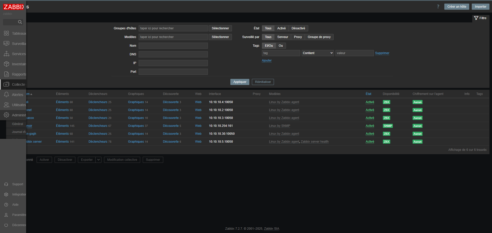

# Documentation – Supervision avec Zabbix

## 📘 Présentation

**Zabbix** est une solution open source de supervision réseau et système. Elle permet de surveiller des serveurs, des équipements réseau, des applications et des services à travers des agents, des requêtes SNMP, ICMP, HTTP, etc.

Dans ce homelab, Zabbix est installé sur une VM avec l’adresse IP **10.10.10.5**.


## 🖥️ Architecture de supervision


```
          +------------------+
          |   Zabbix Server  |
          | 10.10.10.5       |
          +------------------+
                    |
    +---------------+----------------+
    |               |                |
+--------------+ +----------------+ +------------------+
| Linux Client | | Windows Client | | Équipements SNMP |
| 10.10.10.x   | | 10.10.10.x     | | (pfSense, etc.)  |
+--------------+ +----------------+ +------------------+
```


## ⚙️ Installation de Zabbix Server

```bash
su -
```

```bash
apt update
```

```bash
vi /etc/network/interfaces
```

```bash
# The loopback network interface
auto lo
iface lo inet loopback

auto ens18
iface ens18 inet static
address 10.10.10.5
netmask 255.255.255.0
gateway 10.10.10.254
dns-search int.wmbakopt.com
dns-nameservers 8.8.8.8
dns-nameservers 10.10.10.3 10.10.10.4
```

```bash
systemctl restart networking && systemctl status networking
```

### Installation du serveur

```bash
wget https://repo.zabbix.com/zabbix/7.2/release/debian/pool/main/z/zabbix-release/zabbix-release_latest_7.2+debian12_all.deb
```

```bash
dpkg -i zabbix-release_latest_7.2+debian12_all.deb
```

```bash
apt update
```

```bash
apt install zabbix-server-mysql zabbix-frontend-php zabbix-apache-conf zabbix-sql-scripts zabbix-agent
```


```bash
apt install mariadb-server mariadb-client
```

```bash
systemctl start mariadb
```

```bash
systemctl enable mariadb
```

```bash
systemctl status mariadb
```


```bash
mysql -uroot -p
```

```bash
create database zabbix character set utf8mb4 collate utf8mb4_bin;
```

```bash
create user zabbix@localhost identified by 'password';
```

```bash
grant all privileges on zabbix.* to zabbix@localhost;
```

```bash
set global log_bin_trust_function_creators = 1;
```

```bash
quit;
```

```bash
zcat /usr/share/zabbix/sql-scripts/mysql/server.sql.gz | mysql --default-character-set=utf8mb4 -uzabbix -p zabbix
```


```bash
mysql -uroot -p
```

```bash
set global log_bin_trust_function_creators = 0;
```

```bash
quit;
```

```bash
vi /etc/zabbix/zabbix_server.conf
```

```bash
DBPassword=password
```


```bash
systemctl restart zabbix-server zabbix-agent apache2
```

```bash
systemctl enable zabbix-server zabbix-agent apache2
```

Ouvrir dans le navigateur http://10.10.10.5/zabbix/


### Installer Zabbix Agent sur chaque machine cliente

Suivre cette procédure : https://www.zabbix.com/download?zabbix=7.2&os_distribution=ubuntu&os_version=24.04&components=server_frontend_agent&db=mysql&ws=apache

l'étape D n'est pas à faire pour les machines clientes

```bash
apt update


```bash
apt install zabbix-agent -y
```

```bash
vi /etc/zabbix/zabbix_agentd.conf
```

```bash
Server=127.0.0.1
ServerActive=127.0.0.1
Hostname=MettreNomMachineCliente
```

```bash
systemctl restart zabbix-agent && systemctl status zabbix-agent
```

```bash
systemctl enable zabbix-agent
```


### Installer Zabbix Agent sur chaque machine cliente Pfsense

Se connecter à l'interface graphique de Pfsense

Aller dans Services > SNMP


Se connecter à l'interface graphique de Zabbix

Aller dans Collecte de données > Hôtes, Puis cliquer sur Créer un hôte


### Résultat





## Liens utiles

https://www.zabbix.com/documentation/current/en/manual

https://www.youtube.com/watch?v=WPnFDjf56XA&list=PLn6POgpklwWq6Qp4vekHy3bCz-SJi_t0X&index=1